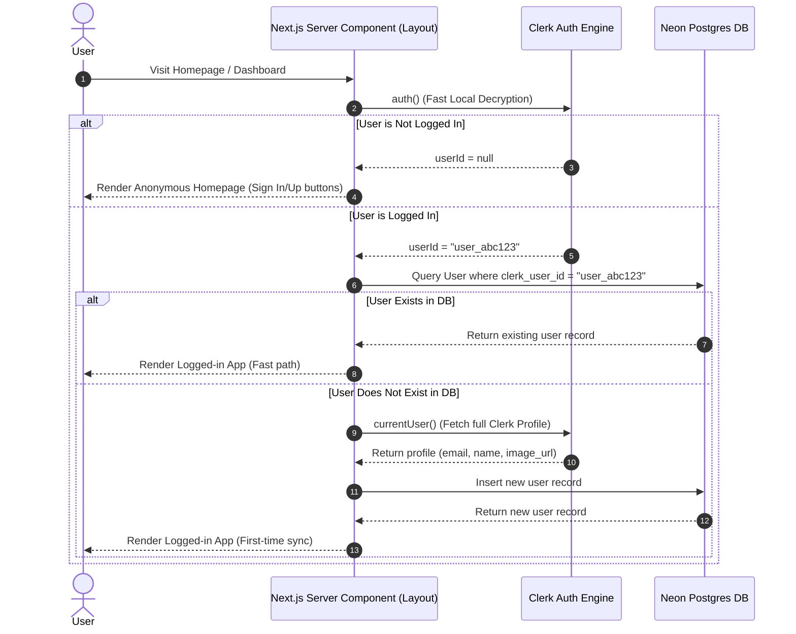

# Chapter 1: The Making of Auth and Login (Webhook-less Sync)

In this chapter, we document the architectural decisions, database setup, and code implementation for integrating Clerk Authentication with our Neon PostgreSQL database. 

Our goal was to ensure that whenever a user signs up or signs in, their user information (email, name, image URL, and timestamps) is immediately synchronized to our Postgres database—**without using webhooks** (which require public endpoint tunnels, Clerk event configuration, and add latency).

---

## 1. Architectural Strategy: The Lazy Server-Side Sync

To avoid webhooks, we implemented a server-side synchronization check during the Next.js page request lifecycle.



### Key Advantages of this Design:
- **Zero Webhook Latency/Overhead**: No public endpoints to configure, no signature validation keys to manage, and no webhook queue delays.
- **Optimal Performance**: By checking Clerk's local session cookie (`auth()`) first and doing a fast indexed database lookup, we perform **zero Clerk API requests** for users that already exist in our database. The heavier Clerk API request (`currentUser()`) is only called once per user during their very first visit.
- **Resilient Account Linking**: If a user record was pre-seeded or created manually, the sync automatically detects the matching email address and links the Clerk ID, preventing unique constraint violations.

---

## 2. Implementation Steps

### Step 2.1: Aligning the Database Schema
The database contains a `users` table. We aligned our local Drizzle ORM schema in `db/schema.ts` to map perfectly to the actual Neon Postgres database structure.

**[db/schema.ts](file:///c:/Users/soham/OneDrive/Desktop/everyday%20tracker/everyday-tracker/db/schema.ts)**:
```typescript
import { pgTable, serial, text, timestamp } from "drizzle-orm/pg-core";

export const users = pgTable("users", {
  id: serial("id").primaryKey(),
  clerkUserId: text("clerk_user_id").notNull().unique(),
  name: text("name"),
  imageUrl: text("image_url"),
  email: text("email").notNull().unique(),
  lastSignedInAt: timestamp("last_signed_in_at"),
  createdAt: timestamp("created_at").defaultNow().notNull(),
  updatedAt: timestamp("updated_at").defaultNow().notNull(),
});

export type User = typeof users.$inferSelect;
export type NewUser = typeof users.$inferInsert;
```

---

### Step 2.2: Building the Synchronization Helper
We created a dedicated helper function `checkAndSyncUser` in `lib/user-sync.ts`. It securely fetches user info, performs the existence checks, and safely handles Next.js compile-time pre-rendering signals.

**[lib/user-sync.ts](file:///c:/Users/soham/OneDrive/Desktop/everyday%20tracker/everyday-tracker/lib/user-sync.ts)**:
```typescript
import { auth, currentUser } from "@clerk/nextjs/server";
import { db } from "@/db";
import { users } from "@/db/schema";
import { eq } from "drizzle-orm";

export async function checkAndSyncUser() {
  try {
    const { userId } = await auth();
    if (!userId) return null;

    // 1. Fast local db check by clerkUserId
    const dbUser = await db.query.users.findFirst({
      where: eq(users.clerkUserId, userId),
    });

    if (dbUser) {
      return dbUser;
    }

    // 2. Fetch full user details from Clerk (only occurs once on first sign-in)
    const clerkUser = await currentUser();
    if (!clerkUser) return null;

    const email = clerkUser.emailAddresses[0]?.emailAddress;
    if (!email) {
      console.warn("User has no email address: ", userId);
      return null;
    }

    const name = `${clerkUser.firstName || ""} ${clerkUser.lastName || ""}`.trim() || null;
    const imageUrl = clerkUser.imageUrl || null;

    // 3. Fallback check: Link account if email already exists
    const existingUserByEmail = await db.query.users.findFirst({
      where: eq(users.email, email),
    });

    if (existingUserByEmail) {
      const [updatedUser] = await db.update(users)
        .set({ 
          clerkUserId: userId, 
          name, 
          imageUrl, 
          lastSignedInAt: new Date(),
          updatedAt: new Date() 
        })
        .where(eq(users.email, email))
        .returning();
      console.log("Successfully linked Clerk ID to existing user email:", email);
      return updatedUser;
    }

    // 4. Create new user record
    const [newUser] = await db.insert(users).values({
      clerkUserId: userId,
      email,
      name,
      imageUrl,
      lastSignedInAt: new Date(),
    }).returning();

    console.log("Successfully created and synced user to database:", email);
    return newUser;
  } catch (error: any) {
    // Rethrow Next.js dynamic server usage errors so Next.js knows to opt-out of static rendering
    if (error && typeof error === 'object' && (error.digest === 'DYNAMIC_SERVER_USAGE' || error.message?.includes('Dynamic server usage'))) {
      throw error;
    }
    console.error("Error during user sync:", error);
    return null;
  }
}
```

---

### Step 2.3: Root Layout Hook
We hook this sync logic directly inside our root layout server component. This guarantees that user checking happens automatically regardless of what route the authenticated user visits first.

**[app/layout.tsx](file:///c:/Users/soham/OneDrive/Desktop/everyday%20tracker/everyday-tracker/app/layout.tsx)**:
```typescript
import { ClerkProvider } from '@clerk/nextjs';
import { checkAndSyncUser } from "@/lib/user-sync";
import "./globals.css";
import type { Metadata } from "next";

export const metadata: Metadata = {
  title: "Next.js Premium Startup Boilerplate",
  description: "Created using the ultimate interactive Next.js stack generator CLI.",
};

export default async function RootLayout({
  children,
}: Readonly<{
  children: React.ReactNode;
}>) {
  // Sync the authenticated user details with the Neon database if logged in
  await checkAndSyncUser();

  return (
    <ClerkProvider>
      <html lang="en">
        <body style={{ margin: 0, padding: 0 }}>
          {children}
        </body>
      </html>
    </ClerkProvider>
  );
}
```

---

### Step 2.4: Clerk Authentication Middleware Configuration
In Next.js 16, Clerk middleware is configured under the new convention `proxy.ts` at the root.

**[proxy.ts](file:///c:/Users/soham/OneDrive/Desktop/everyday%20tracker/everyday-tracker/proxy.ts)**:
```typescript
import { clerkMiddleware } from "@clerk/nextjs/server";

export default clerkMiddleware();

export const config = {
  matcher: [
    '/((?!_next|[^?]*\\.(?:html|css|js|gif|svg|jpg|jpeg|png|woff|woff2|ico|csv|docx|xlsx|zip|webmanifest)).*)',
    '/(api|trpc)(.*)',
  ],
};
```

---

### Step 2.5: Homepage UI Integration
To make the authentication visible and user-friendly, we integrated Clerk's interactive action triggers into the homepage, using server-side auth checking.

**[app/page.tsx](file:///c:/Users/soham/OneDrive/Desktop/everyday%20tracker/everyday-tracker/app/page.tsx)**:
- Import `SignInButton`, `SignUpButton`, and `UserButton` from `@clerk/nextjs`.
- Import `auth` from `@clerk/nextjs/server` to check authentication status server-side.
- Add a top header with logo and dynamic login actions:
  - If **Signed Out**: Show "Sign In" and "Sign Up" modal buttons.
  - If **Signed In**: Show Clerk's interactive avatar dropdown (`UserButton`).
- Update Hero CTAs to dynamically direct users to either Clerk sign-up or their dashboard.

---

## 3. Verification & Live Status
The application successfully builds, compiles, and runs.
- **Local Server**: http://localhost:3000
- **Verification Result**: Logging in via Clerk triggers `checkAndSyncUser()`, which successfully inserted the user details into the `users` table inside the Neon database.
